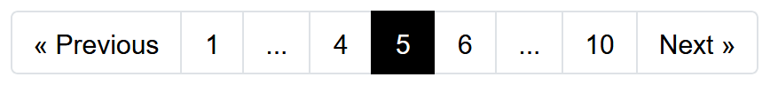
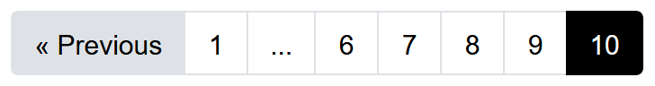
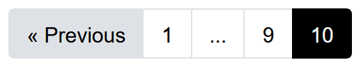

# PHP Pagination

A simple PHP paginator class, to create your own custom pagination.
The pagination class requires only the current page number, the total items, the total items per page 
and an urlpattern to build the page URLs. 
After providing the class with these parameters you can retrieve page components.

## Components

A component is a simple array with some page data:

```
array(
	'page_number' => 2
	'url' => '//www.example.com/?page=2',
	'is_current' => false,
	'is' => 'next'
)
```

There are 7 possible components available via their methods:
- `getFirstPage()` to get data of the first page. There's always a first page available.
- `getPrevPage()` to get the previous page. However, the first page doesn't have a previous page.
- `getCurrentPage()` to get the current page.
- `getPages()` to get an array with a max number of pages.
- `getAdjacentPages()` to get an array with adjacent pages.
- `getNextPage()` to get the next page. However, the last page doesn't have a next page.
- `getLastPage()` to get the last page. There's always a last page available.

The methods `getListWithMaxLength()` and `getListWithAdjacents()` return both an array of pages, including the first and last page.

## Design

You can use the components to design pagination controls with your own custom HTML and CSS.
You can for instance create a simple design with only the previous and next components, but you can also create a design with multiple 
components.
The [examples](examples) folder contains a default design you often see. One example is build with Bootstrap CSS.
You can use these as a starting point for your own design.

<br>
<br>
<br>
<br>
<br>

## Installation

You only have to include the file [src/pagination.php](src/pagination.php) into your project.

## Basic usage

A simple example to get started:

```
<?php

include('../src/pagination.php');

use Camielvg\Pagination;

$currentPage = !empty($_GET['page']) ? (int) $_GET['page'] : 1;
$itemsPerPage = 10;
$totalItems = 100;
$urlPattern = '//www.example.com/?page=(:num)';
$numberOfPagesToShow = 7;
$adjacents = 2;

$pagination = new Pagination($currentPage, $itemsPerPage, $totalItems, $urlPattern);

// Get single components. Uncomment a line to see the return value.
// var_dump($pagination->getFirstPage());
// var_dump($pagination->getPrevPage());
// var_dump($pagination->getCurrentPage());
// var_dump($pagination->getPages($numberOfPagesToShow, 0, 'replace'));
// var_dump($pagination->getAdjacentPages($adjacents));
// var_dump($pagination->getNextPage());
// var_dump($pagination->getLastPage());

// Or get one of the two lists with combined components.
// var_dump($pagination->getListWithMaxLength($numberOfPagesToShow));
// var_dump($pagination->getListWithAdjacents($adjacents));

?>
<!DOCTYPE html>
<head>

	<title>Pagination</title>

	<link rel="stylesheet" href="https://maxcdn.bootstrapcdn.com/bootstrap/4.0.0/css/bootstrap.min.css">

</head>
<body>

<ul class="pagination justify-content-center m-5">
	<?php
		// prev
		if (!empty(($prev = $pagination->getPrevPage()))) {
			echo '<li class="page-item"><a href="' . $prev['url'] . '" class="page-link">Previous</a></li>';
		}

		// pages
		if (!empty(($pages = $pagination->getListWithAdjacents($adjacents)))) {
			foreach ($pages as $page) {
				if ($page['is_current'] === true) {
					echo '<li class="page-item active"><span class="page-link">' . $page['page_number'] . '</span></li>';
				} elseif ($page['page_number'] == '...') {
					echo '<li class="page-item disabled"><span class="page-link">...</span></li>';
				} else {
					echo '<li class="page-item"><a href="' . $page['url'] . '" class="page-link">' . $page['page_number'] . '</a></li>';
				}
			}
		}

		// next
		if (!empty(($next = $pagination->getNextPage()))) {
			echo '<li class="page-item"><a href="' . $next['url'] . '" class="page-link">Next</a></li>';
		}
	?>
</ul>

</body>
</html>
```

## URL building

By default the pagination class requires an urlpattern with a placeholder "(:num)" for the page number, 
e.g. "//www<span>.</span>example.com/?page=(:num)".
The page URLs are build by replacing the placeholder "(:num)" with the respective page number.

It is also possible to build the URLs via your own custom function. This can be interesting when URL 
building is more dynamic. For instance if you want to use friendly URLs like "//www<span>.</span>example.com/page/2" 
or if you want the URL of page 1 without the page number.

You can do this by setting a callback function via the `urlBuilderCallback` property.
The property excepts any callable (see [php.net](http://php.net/manual/en/language.types.callable.php)), 
like a simple function, but it could also be a class.
The parameters `$pageNumber` and `$urlPattern` will be passed to your callback function. 

## Advanced usage

An example with a simple callback function to build a custom URL.

```
<?php

include('../src/pagination.php');

use Camielvg\Pagination;

// A simple callback function.
function buildMyCustomPageUrl($pageNumber, $urlPattern)
{
	if ($pageNumber == 1) {
		return $urlPattern;
	} else {
		return $urlPattern . '?page=' . $pageNumber;
	}
}

$currentPage = !empty($_GET['page']) ? (int) $_GET['page'] : 1;
$itemsPerPage = 10;
$urlPattern = '//www.example.com/';
$numberOfPagesToShow = 7;

$pagination = new Pagination($currentPage, $itemsPerPage, 0, $urlPattern);
$pagination->setTotalItems(100);

// Set the custom callback function.
$pagination->urlBuilderCallback = 'buildMyCustomPageUrl';

// Followed by a html view.
```

## Sql query example

An example to paginate database results.

```
$limit = $pagination->itemsPerPage;
$offset = $pagination->itemsOffset;
$sql = "SELECT * FROM {$table} LIMIT {$limit} OFFSET {$offset}";
```
